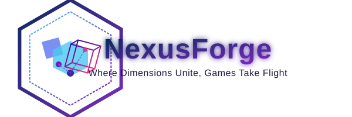

<p align="center">
  
</p>

<div align="center">
  
  
  
  
  
  
</div>

## Vision

NexusForge is an ambitious open-source game development framework designed to grow with your skills and projects. Starting with robust 2D capabilities and architected for a seamless transition to 3D, NexusForge aims to be the connection point between your creative vision and technical implementation.

Our philosophy centers on three core principles:
- **Approachable yet powerful**: Simple enough for beginners, sophisticated enough for professionals
- **Scalable architecture**: Start small with 2D and scale up to complex 3D environments
- **Community-driven**: Built by developers, for developers, with extensive documentation and examples

Whether you're building a simple 2D platformer or dreaming of creating the next open-world adventure, NexusForge provides the foundation to make it happen.

## Key Features

### Current & Near-Term (2D Focus)
- Efficient 2D rendering engine with sprite batching
- Robust physics system for 2D environments
- Component-based entity system
- Scene management with hot-reloading
- Input handling for keyboard, mouse, and controllers
- Audio engine supporting spatial sound
- Asset management pipeline
- Powerful event system
- Cross-platform support (Windows, macOS, Linux)

### Future Expansion (3D Capabilities)
- Modern 3D rendering pipeline
- Advanced physics for vehicles and characters
- World streaming for open environments
- Animation systems with blending and IK
- Advanced AI and pathfinding
- Particle and effects systems
- Terrain generation and management
- Extended toolset for world building

## Project Structure

```
NexusForge/
├── assets/             # Engine assets (sprites, shaders, fonts, etc.)
├── docs/               # Documentation
│   ├── architecture/   # Architecture designs and diagrams
│   ├── design/         # Design documents and specifications
│   └── roadmap/        # Development roadmap and milestones
├── examples/           # Example projects demonstrating engine features
├── src/                # Source code
│   ├── core/           # Core engine systems
│   ├── graphics/       # Rendering and visual systems
│   ├── physics/        # Physics and collision detection
│   ├── audio/          # Sound system
│   ├── input/          # Input handling
│   └── utils/          # Utility functions and tools
├── tests/              # Unit and integration tests
└── tools/              # Development and build tools
```

## Development Roadmap

NexusForge follows a phased development approach, starting with a solid 2D foundation before expanding to 3D capabilities:

### Phase 1: Core 2D Engine (Current)
- Establish core architecture and systems
- Implement basic 2D rendering
- Develop initial physics and collision systems
- Create component-based entity framework
- Build basic audio and input systems

### Phase 2: Enhanced 2D Features
- Advanced 2D lighting and particle effects
- Improved physics with joints and constraints
- UI system with theming support
- Advanced animation system for sprites
- Networking foundation

### Phase 3: Transition to 3D
- 3D rendering pipeline
- 3D physics integration
- Camera systems
- Basic 3D model support
- Lighting and shadow systems

### Phase 4: Advanced 3D Features
- Advanced material system
- Terrain system
- Character controllers
- Vehicle physics
- World streaming

### Phase 5: AAA Features
- Advanced animation systems
- AI and pathfinding
- Post-processing pipeline
- Advanced audio
- Performance optimization

## Getting Started

> Note: NexusForge is currently in early development. This section will be expanded as the project matures.

### Prerequisites
- C++ compiler with C++17 support
- CMake 3.15+
- Graphics drivers supporting OpenGL 4.5 or Vulkan 1.2

### Building from Source
```bash
git clone https://github.com/A5873/NexusForge.git
cd NexusForge
mkdir build && cd build
cmake ..
make
```

### Basic Example
```cpp
#include "NexusForge.h"

int main() {
    nf::Engine engine;
    nf::Scene scene;
    
    // Create a sprite entity
    auto entity = scene.CreateEntity();
    entity.AddComponent<nf::SpriteComponent>("player.png");
    entity.AddComponent<nf::TransformComponent>(0.0f, 0.0f);
    entity.AddComponent<nf::PhysicsComponent>();
    
    // Start the game loop
    engine.Run(scene);
    
    return 0;
}
```

## Contributing

NexusForge is a community-driven project and welcomes contributions of all forms:

1. **Code**: Implement new features or fix bugs
2. **Documentation**: Improve or expand documentation
3. **Examples**: Create example projects showcasing capabilities
4. **Testing**: Help identify and fix issues
5. **Ideas**: Suggest new features or improvements

### Development Process
1. Fork the repository
2. Create a feature branch (`git checkout -b feature/amazing-feature`)
3. Commit your changes (`git commit -m 'Add some amazing feature'`)
4. Push to the branch (`git push origin feature/amazing-feature`)
5. Open a Pull Request

Please see [CONTRIBUTING.md](CONTRIBUTING.md) for detailed guidelines.

## License

NexusForge is released under the MIT License. See [LICENSE](LICENSE) for details.

---

*NexusForge is in active development. Star and watch the repository to stay updated on progress!*

